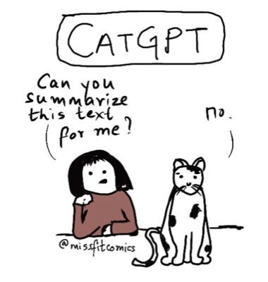

# 🐱 CatGPT Meme Generator

Transform your questions into sassy cat wisdom! A collaboration between [Pollinations.AI](https://pollinations.ai) and [Tanika Godbole](https://www.instagram.com/tanikagodbole/), the original creator of the CatGPT comic.

## 🌟 About

CatGPT is an AI-powered meme generator that creates personalized cat comics in response to your questions. Just like the original CatGPT comic, our feline friend responds with lazy, sarcastic wisdom while treating humans as mere servants.

### 🎨 Original Inspiration

The CatGPT concept was created by Tanika Godbole. Check out the [first CatGPT comic on Instagram](https://www.instagram.com/p/Cn4OLhPyDLP/)!



## ✨ Examples

Here are some AI-generated CatGPT memes:

<div align="center">
  
  
</div>

## 🚀 Features

- **AI-Powered Generation**: Uses OpenAI's GPT-Image-1 model via Pollinations.AI
- **Instant Memes**: Generate custom cat wisdom in seconds
- **Share & Download**: Save your favorite memes or share them with friends
- **No Sign-up Required**: Completely free and open to use
- **Gen-Z Friendly Design**: Modern, vibrant, and fun UI

## 🛠️ Tech Stack

- **Frontend**: Pure HTML, CSS, and JavaScript (no frameworks needed!)
- **AI Service**: [Pollinations.AI](https://pollinations.ai) Image API
- **Design**: Psychedelic Gen-Z aesthetic with animated elements

## 🎯 How to Use

1. Visit the [CatGPT Meme Generator](https://pollinations.github.io/catgpt/)
2. Type your question in the text box
3. Click "Generate Meme" 
4. Watch as CatGPT responds with feline wisdom!
5. Download or share your creation

## 💻 Local Development

```bash
# Clone the repository
git clone https://github.com/voodoohop/catgpt.git

# Navigate to the project
cd catgpt

# Open in your browser
open index.html
# or use a local server
python -m http.server 8000
```

## 🤝 Credits & Collaboration

- **Original CatGPT Creator**: [Tanika Godbole](https://www.instagram.com/tanikagodbole/)
- **AI Technology**: [Pollinations.AI](https://pollinations.ai)
- **Idea Credit**: Dr. Julia Degen
- **Sponsor**: [PuraPep](https://www.purapep.de/) - Premium pet food for happy cats 🐾

## 📝 License

This project is a collaboration between Pollinations.AI and Tanika Godbole. The CatGPT character and concept are the intellectual property of Tanika Godbole. AI-generated variations are created with permission and include revenue sharing with the original creator.

## 🌈 Fun Facts

- Try the Konami code on the website for a surprise! (↑↑↓↓←→←→BA)
- Each generated meme has a unique seed for variety
- The cat's responses are intentionally sarcastic - that's the CatGPT way!

---

Made with 💜 by [Pollinations.AI](https://pollinations.ai) in collaboration with [Tanika Godbole](https://www.instagram.com/tanikagodbole/)
